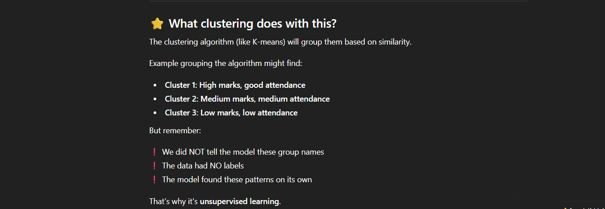
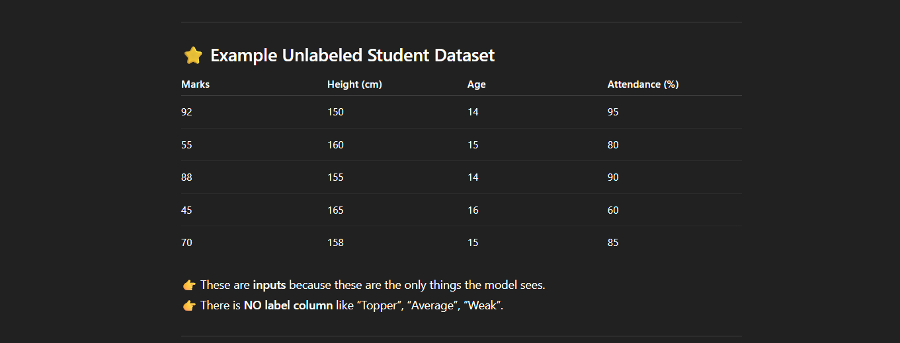

# Unsupervised Learning
In this type of learning we train model with unlabeled data.mean we don't give the model output we only give input.the model analysis the patterns by itself so it trained itself using the unlabeled data.
*What are the term we are talking about when we says unlabeled data?*
Unlabeled data basically mean we don't give the model the relation or the pattern that is required to predict the output.
let's take the **example** to explain about more in term of **unlabelled data**.
1.
2.

That is the most important thing because if the model is not seeing those it try to find the pattern and try to analyis it.